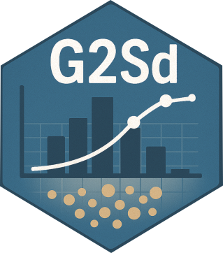

# G2Sd : Grain-size Statistics and Description of Sediment



[](https://CRAN.R-project.org/package=G2Sd) [](https://cran.r-project.org/package=G2Sd) [](https://www.r-project.org/) [](https://www.r-project.org/)

## Table of Contents

- [Authors](#authors)
- [Overview](#overview)
- [Details](#details)
- [Installation](#installation)
- [Quick Start Examples](#quick-start-examples)
- [Interactive Shiny Application](#interactive-shiny-application)
- [Getting Help](#getting-help)
- [Citation](#citation)
- [Contributing](#contributing)
- [References](#references)
- [License](#license)


## Authors

-   Regis K. Gallon (CNAM-Intechmer) [regis.gallon\@lecnam.net](regis.gallon@lecnam.net)
-   Jerome Fournier (CNRS) [fournier\@mnhn.fr](fournier@mnhn.fr)

## Overview

**G2Sd** provides comprehensive descriptive statistics and physical descriptions of sediment based on grain-size distribution data obtained from metric or phi sieves.

## Details

The G2Sd package is an evolution of the Gradistat v.4.0 macro for MS Excel initially developped by Blott and Pye (2001) for phi sieves and Laser granulometer. This package is suited to analyse data obtained from metric (micrometer) or phi sieves. The user is required to input the weight of sediment retained on sieves spaced at any metric or phi intervals. Statistics are calculated using arithmetic and geometric Method of Moments (micrometer) and using logarithmic Folk and Ward (1957) Method (phi scale): mean, standard-deviation, skewness, kurtosis. The mode(s) is(are) determined graphically by the user (with a maximum of 4 modes). The determination of the mode is optional (no determination by default). Several percentiles and common index are calculated: D10, D50, D90, D90/D10, D90-D10, D75/D25, D75-D25, Trask(So) Index, Krumbein(Qd) Index. Physical description of texture, sorting, skewness or kurtosis are provided as such as the sediment name after Folk (1954). Are also included the percentage of particules falling into each predefined size fraction, modified from Blott and Pye (2001) scale, Udden (1914) and Wentworth (1922). There are three main functions :

-   `granstat` is a function which provides all results organized in two ways: a complete matrix (by default) or by separate items;
-   `granplot` is a function which provides a histogramm with a cumulative percentage curve;
-   `grandistrib` is a function which provides a barplot of the different fractions composing the sediment

The package also includes an **interactive Shiny web application** for user-friendly analysis and visualization of grain-size data, featuring modern UI with plotly interactive plots.

## Installation

### From CRAN (Stable Version)

The easiest way to install G2Sd is from CRAN:

``` r
install.packages("G2Sd")
```

### From GitHub (Development Version)

To install the development version from GitHub:

``` r
# Install remotes package 
install.packages("remotes")

# Install G2Sd from GitHub
remotes::install_github("gallonr/G2Sd")
```

After installation, load the package:

``` r
library(G2Sd)
```

## Quick Start Examples

### Loading the Package and Data

``` r
library(G2Sd)

# Load example dataset
data(granulo)

# View the structure of the data
head(granulo)
```

The `granulo` dataset contains grain-size data from 21 sediment samples with AFNOR sieve sizes (in micrometers).

### Example 1: Basic Statistical Analysis

Calculate grain-size statistics for a single sample:

``` r
# Analyze the first sample (column 2)
result <- granstat(granulo[, 2, drop = FALSE])

# View the complete results
print(result)
```

This will provide:
- Mean, standard deviation, skewness, and kurtosis (arithmetic, geometric, and Folk & Ward methods)
- Key percentiles (D5, D10, D16, D25, D50, D75, D84, D90, D95)
- Sediment classification (Folk 1954)
- Textural descriptions and fraction percentages

### Example 2: Visualizing Grain-Size Distribution

Create a histogram with cumulative curve:

``` r
# Plot the grain-size distribution for sample 1
granplot(granulo, 1)

# Plot with custom title
granplot(granulo, 1, main = "Station A - Grain Size Distribution")
```

### Example 3: Analyzing Sediment Fractions

Display the distribution of sediment fractions:

``` r
# Show sediment fractions for sample 5
grandistrib(granulo, 5)

# This creates a barplot showing percentages of:
# - Gravel, sand (very coarse to very fine), silt, and clay fractions
```

### Example 4: Batch Processing Multiple Samples

Analyze all samples in the dataset:

``` r
library(purrr)
library(dplyr)

# Analyze all samples using purrr::map
results_list <- granulo |>
  select(-1) |>  # Remove the size column
  map(~ granstat(data.frame(.x)))

# Extract mean grain sizes for all samples
mean_sizes <- results_list |>
  map_dbl(~ .x$stat$arith$mean.arith.um)

print(mean_sizes)

# Or using traditional approach without additional packages
results_list <- lapply(2:ncol(granulo), function(i) {
  granstat(granulo[, i, drop = FALSE])
})

mean_sizes <- sapply(results_list, function(x) x$stat$arith$mean.arith.um)
```

### Example 5: Complete Analysis Workflow

``` r
library(G2Sd)

# Load data
data(granulo)

# Analyze sample 3
sample_stats <- granstat(granulo[, 3, drop = FALSE])

# Display key statistics
cat("Mean grain size (arithmetic):", sample_stats$stat$arith$mean.arith.um, "µm\n")
cat("Mean grain size (Folk & Ward):", sample_stats$stat$fowa$mean.fw.um, "µm\n")
cat("Sediment type:", sample_stats$stat$fowa$sediment, "\n")
cat("Texture:", sample_stats$sedim$texture$texture, "\n")

# Visualize the distribution
granplot(granulo, 3)

# Show fraction composition
grandistrib(granulo, 3)
```

## Interactive Shiny Application

G2Sd includes a powerful interactive web application built with Shiny, allowing you to analyze and visualize grain-size data through an intuitive graphical interface.

### Features

The Shiny application provides:

- **Interactive data import**: Load your own CSV/TXT files or use example data
- **Multiple calculation methods**: Choose between Arithmetic, Geometric, or Folk & Ward methods
- **Interactive plots**: Zoom, pan, and explore distributions with plotly
- **Real-time analysis**: Instant statistical calculations as you explore your data
- **Multi-sample comparison**: Analyze and compare multiple samples simultaneously
- **Export results**: Download statistics tables and high-quality plots
- **Modern UI**: Clean, responsive interface with Bootstrap 5 styling

### Launching the Application

To start the Shiny application:

``` r
library(G2Sd)

# Launch the interactive application
granstat(web_interface = TRUE)
```

This will open the application in your default web browser. The interface includes:

1. **Sidebar controls**: 
   - Data loading (example or custom files)
   - Statistical method selection
   - Sample selection
   - Plot customization options

2. **Main panel**:
   - Interactive histogram with cumulative curve
   - Statistical results table
   - Sediment fraction distribution
   - Multi-sample ternary diagrams

### Using Your Own Data

The application accepts CSV or TXT files with:
- Sieve sizes in micrometers as row names
- Sample names as column headers
- Weight retained on each sieve in the cells

Example format:
```
Size,Sample1,Sample2,Sample3
2000,5.2,3.1,7.5
1000,12.5,8.3,15.2
500,25.8,20.1,28.6
...
```
### Application Workflow

1. **Load Data**: Click "Load example data" or upload your own file
2. **Select Method**: Choose your preferred calculation method
3. **Select Samples**: Pick one or more samples to analyze
4. **Explore Results**: 
   - View interactive plots
   - Examine statistical parameters
   - Compare fraction distributions
5. **Export**: Download results and figures for your reports


## Getting Help

For detailed documentation on each function:

``` r
?granstat      # Statistical analysis
?granplot      # Histogram and cumulative curve
?grandistrib   # Fraction distribution
?granulo       # Example dataset description
```

To launch the interactive Shiny application:
``` r
granstat(web_interface = TRUE)
```

## Citation

If you use G2Sd in your research, please cite:

``` r
citation("G2Sd")
```

## Contributing

Contributions, bug reports, and feature requests are welcome! Please feel free to open an issue or submit a pull request on [GitHub](https://github.com/gallonr/G2Sd).

## References

Blott, S., Pye, K. 2001. Gradistat: grain size distribution and statistics package for the analysis of unconsolidated sediment. *Earth, Surface Processes and Landforms* **26**, 1237-1248

Folk, R.L. 1954. The distinction between grain size and mineral composition in sedimentary-rock nomenclature. *Journal of Geology* **62**, 344-359

Folk, R.L., Ward, W.C. 1957. Brazos River bar: a study in the significance of grain size parameters. *Journal of Sedimentary Petrology* **27**, 3-26

Krumbein, W.C., Pettijohn, F.J. 1938. *Manual of Sedimentary Petrography*. Appleton-Century-Crofts, New-York

Udden, J.A. 1914. Mechanical composition of clastic sediments. *Bulletin of the Geological Society of America* **25**, 655-744

Wentworth, C.K. 1922. A scale of grade and class terms for clastic sediments. *Journal of Geology* **30**, 377-392

## License

GPL-3

------------------------------------------------------------------------

**Maintainer:** Regis K. Gallon (CNAM-Intechmer) - [regis.gallon\@lecnam.net](mailto:regis.gallon@lecnam.net)